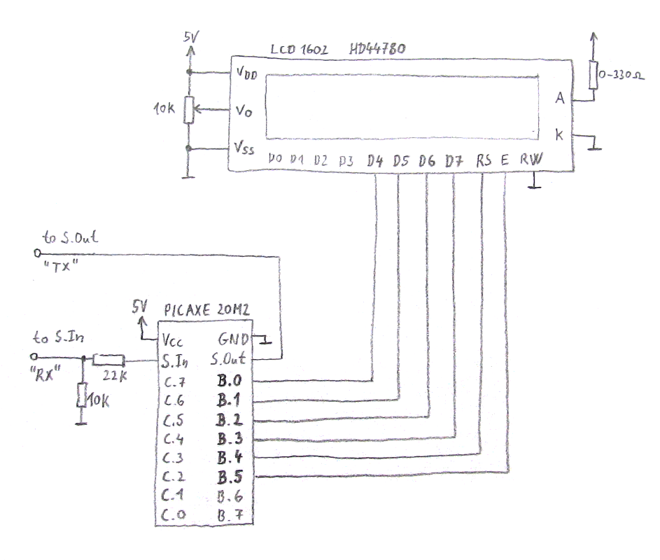

PICAXE BASIC routines for control LCD 1602.
----

Set of PICAXE BASIC routines for control classic LCD 1602 with HD44780 driver.

#### Motivation 

There is some introduction how to use LCDs with HD44780 driver in the official manual 
[picaxe_manual3](https://picaxe.com/docs/picaxe_manual3.pdf) (page 31).
But example program is incomprehensible - it is basically a bunch of magical numbers.
Therefore I decided to study HD44780 datasheet and write my own routines. 

## Alternative LCDs

- oficial AXE033 SERIAL/I2C LCD 
  - easy to use; a bit expensive; also not widely available like LCD 1602 with HD44780
- LCD 1602 with I2C interface 

## Routines

There is the support of 4-bit mode and LCD with one or two lines.

See source code and example programs.

Feel free to modify routines as you need, to add new routines, to remove bugs :)

*Tested only with PICAXE 20M2*

#### for programmer
- lcd_4bm_init
- lcd_init_custom_symbols
- lcd_4bm_send_char
- lcd_clear
- lcd_move_to_col_at_first_line
- lcd_move_to_col_at_second_line
- lcd_move_to_left
- lcd_move_to_right

#### for inner use (primarily, but not exclusively)
- lcd_4bm_send_cmd
- lcd_4bm_send
- lcd_pulse_E
- lcd_lsb_to_Dx_pins 
- lcd_Msb_to_Dx_pins
 

Circuit diagram for the 4-bit mode
----

